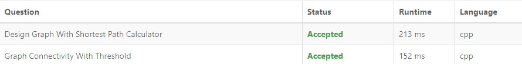

# Exercícios LeetCode

**Conteúdo da Disciplina**: Grafos 2 

# NomedoProjeto

## Alunos
|Matrícula | Aluno |
| -- | -- |
| 19/0087439 | Gabriel de Souza Fonseca Ribeiro |

## Sobre 
Este repositório contem a solução de alguns exercícios do site [LeetCode](www.leetcode.com):

- [1627. Graph Connectivity With Threshold ](https://leetcode.com/problems/graph-connectivity-with-threshold/)
- [2642. Design Graph With Shortest Path Calculator ](https://leetcode.com/problems/design-graph-with-shortest-path-calculator/)

## Screenshots

## Utilização
Basta acessar o link de cada problema e submeter o código, é necessário criar uma conta no LeetCode para rodar o código.

## Explicação
### [ 1627. Graph Connectivity With Threshold](https://leetcode.com/problems/graph-connectivity-with-threshold/)

https://www.youtube.com/watch?v=3ENnivWqXhg

### [ 2642. Design Graph With Shortest Path Calculator](https://leetcode.com/problems/design-graph-with-shortest-path-calculator/)
https://www.youtube.com/watch?v=mFX0pdBh_5c